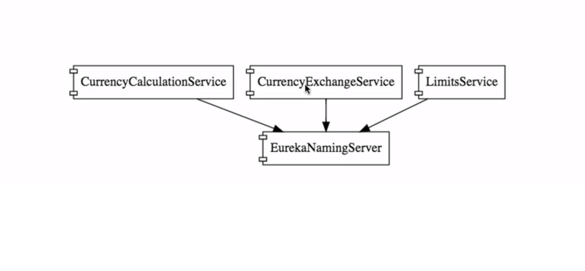

<b>Eureka Naming Server or Service Registry:</b>

It is a Service Registry which helps store the information of all the microservices and enables one micro service to call another microservice.

In Microservices architecture, one microservice call another microservice and exchange data. Let's say Microservice A call Microservice B and lets says there are 5 instances of Mic B. I this case Mic A should know about all the 5 instances of Mic B. So we have to provide all the urls of 5 instances of Mic B in Mic A. That is fine. But, lets say there is a new instance added due to autoscaling of Mic B. Then we have to stop Mic A. Add the url of the 6th instance and restart Mic A. Same thing is true when one or more instances goes down, in this case we have to remove the urls provided in Mic A. This is not possible and not a good idea. So, this is the reason why Service registry is introduced.

Lets say we have a Service Registry which keeps track of all the instances of all microservices, in this case, any microservice can call any other microservice by getting the url of other microservice from Service Registry.

<b>Url to call another microservice after connecting to Eureka:
URL: http://{applicationName}/{URI} --- It gets the url from eureka in a load balanced way and calls the microservice.
ex: http://currency-exchange-service/currency-exchange/from/{from}/to/{to}</b>

All the microservices register with Eureka Server which can be achieved by providing eureka server address in property files all microservices.
-- eureka.client.service-url.default-zone=http://localhost:8761/eureka

Server: @EnableEurekaServer

Client: @EnableDiscoveryClient

<b>Ribbon Client Side Load Balancer:</b>

Lets say, Microservice A is calling Microservice B and there are 5 instances of Microservice B which are up and running. In this case, Which instance of Mic B should Mic A call..? Yes there comes the client side load balancing. The client Mic A should call the Mic B in round robbin fashion which means for the first time it calls 1st instance of Mic B, then 2nd instance, then 3rd instance, then 4th instance and then 5th instance then again 1st instance and so on. This is client side load balancing. Client is balancing the load on multiple instances of Mic B.

@RibbonClient(name="currency-exchange-service")

<b>Feign:</b>

This is a programmer thing. Calling one microservice to another is very common in microservices architecture. Every time we call another microservice, we have to use RestTemplate and write a lot of code. In order to avoid the repetitive code or boiler plate code, Feign was introduced. We have to create a proxy interface which is annotated with @FeignClient and that class should have methods which defines all the url to all the calling services. This makes it easy to call a microservice from controller just by using those proxy methods.

@EnableFeignClients("com.in28minutes.microservices.currencyconversionservice") --On main method.
@FeignClient(name="netflix-zuul-api-gateway-server") -- In Feign proxy class.
